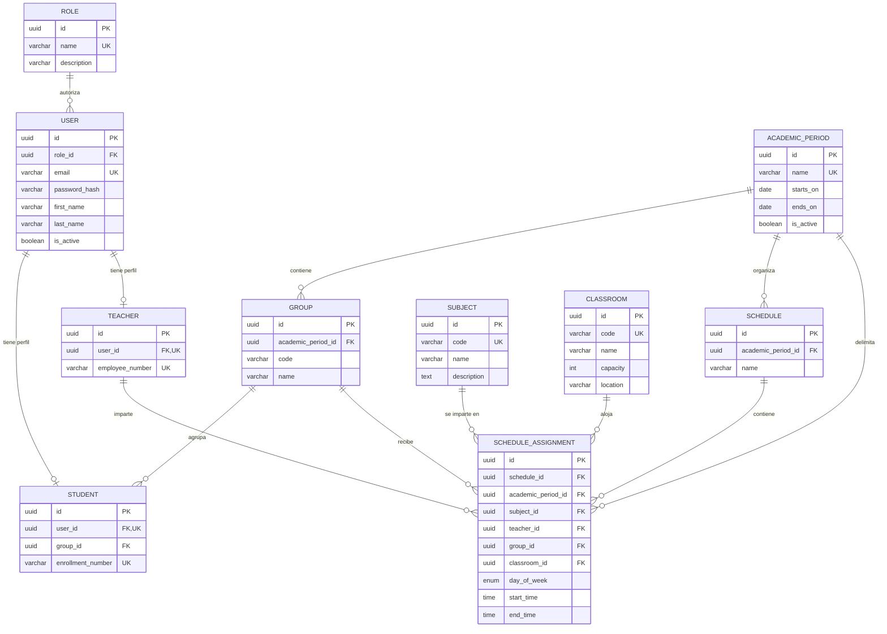

# Modelo inicial de datos — SC-008

Este modelo representa las relaciones académicas iniciales de School Controller. La fuente de
verdad ejecutable es [`apps/api/prisma/schema.prisma`](../apps/api/prisma/schema.prisma) y su
migración inicial está en `apps/api/prisma/migrations`.

## Diagrama entidad-relación



`PK` indica clave primaria, `FK` clave foránea y `UK` clave única. Todas las entidades usan UUID
como clave primaria y tienen campos de auditoría `created_at` y `updated_at`.

## Relaciones y reglas principales

- Un `User` pertenece a un `Role` y puede tener como máximo un perfil `Student` o `Teacher`. Que el
  rol coincida con el tipo de perfil se validará en la capa de aplicación.
- Un `Student` puede pertenecer a un `Group`; la relación es opcional para permitir altas antes de
  asignar grupo.
- Cada `Group` y `Schedule` pertenece a un `AcademicPeriod`.
- `ScheduleAssignment` relaciona horario, periodo, materia, docente, grupo, aula, día y rango de
  hora. Sus claves foráneas compuestas obligan a que horario, grupo y asignación pertenezcan al
  mismo periodo.
- No se permite borrar un registro académico referenciado por una asignación. Al borrar un horario
  sí se eliminan sus asignaciones; al borrar un usuario se elimina únicamente su perfil asociado.
- Las fechas del periodo deben ser válidas, la capacidad de aula debe ser positiva y toda
  asignación debe terminar después de comenzar.

## Detección de colisiones

La migración instala `btree_gist` y crea tres restricciones de exclusión sobre
`ScheduleAssignment`. Dentro del mismo periodo y día, PostgreSQL rechaza rangos de hora que se
solapen para el mismo:

1. docente;
2. grupo;
3. aula.

Los rangos son semiabiertos (`[inicio, fin)`), por lo que una clase puede iniciar exactamente a la
hora en que termina la anterior. Además, los índices por periodo, día y recurso permiten consultar
conflictos antes de intentar guardar una asignación y presentar un mensaje útil en la API.

## Aplicación local

```bash
cp .env.example .env
npm run db:up
npm run db:migrate
```

Para validar o regenerar el cliente de Prisma sin ejecutar migraciones:

```bash
npm run db:validate
npm run db:generate
```
